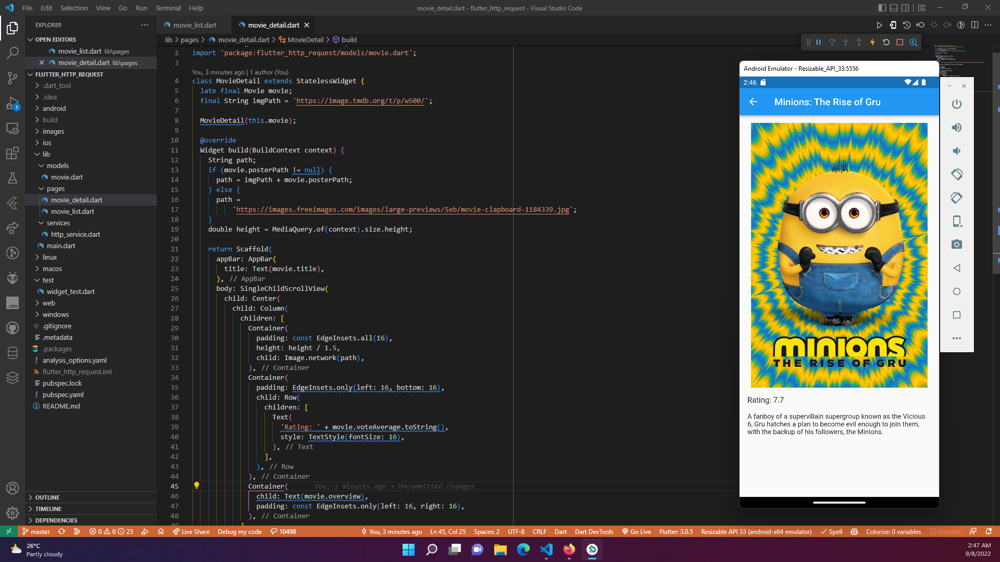

# #24 | HTTP REQUEST DAN REST API

## Studi Kasus Aplikasi Film dengan Akses REST API

- Mengakses Rest API dari themoviedb.org
- Menampilkan film populer
- Menampilkan detail dari film populer yang dipilih oleh user

## Praktikum 

Langkah-langkah praktikum pada [tautan](https://github.com/ferdyfebriyanto/http-request-rest-api-flutter/files/9502443/24.-.HTTP.Request.dan.REST.API.pdf) ini.

Challenge Memodifikasi Tampilan Movie List

Detail Movie

